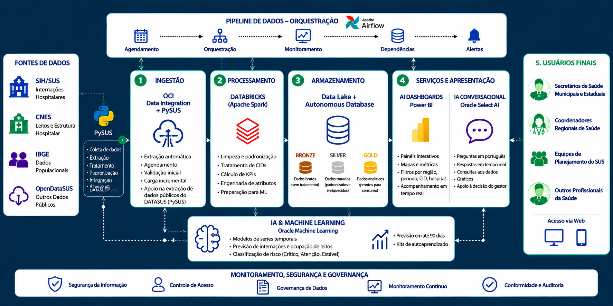

<div align="center">
  
</div>

<br>

### Painel Inteligente de Acesso Hospitalar e Perfil de Atendimento

**Transformando dados de saúde em informação para apoiar decisões.**

<br>


<br>

**Challenge Oracle + FIAP | Data Science | 2026**

</div>

---

## 🏥 Sobre o Medlytics

O **Medlytics** é uma solução de inteligência de dados desenvolvida para apoiar a análise da estrutura hospitalar e do perfil de atendimento do Sistema Único de Saúde (SUS).

A solução integra diferentes fontes de dados da área da saúde, organiza essas informações em uma arquitetura de dados estruturada e disponibiliza indicadores por meio de dashboards interativos.

O objetivo é transformar grandes volumes de dados hospitalares em informações mais acessíveis para gestores e profissionais da saúde, permitindo analisar aspectos como distribuição de leitos, estrutura de UTIs, internações, diagnósticos, CIDs e diferenças estruturais entre regiões.

> **Dados dispersos → dados tratados → informação → análise → apoio à decisão**

---

## 🎯 O problema

O sistema público de saúde gera grandes volumes de dados provenientes de diferentes fontes e sistemas.

Essas informações podem estar distribuídas entre bases distintas, dificultando a análise integrada da infraestrutura hospitalar e do perfil de atendimento.

Entre os desafios analisados pelo projeto estão:

- distribuição de estabelecimentos hospitalares;
- quantidade de leitos existentes e destinados ao SUS;
- estrutura de leitos de UTI;
- diferenças estruturais entre municípios e regiões;
- volume de internações;
- principais diagnósticos e CIDs;
- visualização consolidada de indicadores hospitalares;
- rastreabilidade e governança dos dados utilizados.

O **Medlytics** busca centralizar essas informações em uma solução analítica integrada.

---

## 💡 A solução

O Medlytics foi estruturado em diferentes componentes que trabalham em conjunto durante o ciclo de dados.

| Componente | Função |
|:---|:---|
| 🗃️ **Fontes de Dados** | Fornecimento dos dados hospitalares e estruturais |
| ⚙️ **Engenharia de Dados** | Ingestão, limpeza, transformação e organização |
| 🥉🥈🥇 **Arquitetura Medallion** | Organização dos dados em Bronze, Silver e Gold |
| 🗄️ **Oracle** | Armazenamento e gerenciamento dos dados |
| 📊 **Power BI** | Construção dos dashboards e indicadores |
| 🤖 **Aly** | Interface de consulta em linguagem natural |
| 🛡️ **Governança** | Segurança, qualidade, rastreabilidade e ética |

---

# 🏗️ Arquitetura da Solução

A arquitetura do Medlytics foi projetada para representar o fluxo completo dos dados, desde as fontes até a disponibilização das informações aos usuários finais.

<div align="center">
  
</div>

---

# 🔄 Pipeline de Dados

O pipeline do Medlytics organiza o processamento dos dados em diferentes etapas, permitindo separar dados brutos, tratados e preparados para consumo analítico.

O fluxo segue o conceito da **Arquitetura Medallion**.

### 🥉 Bronze

A camada Bronze recebe os dados próximos ao formato original das fontes.

Seu objetivo é preservar os dados brutos antes das principais transformações.

### 🥈 Silver

Na camada Silver são realizadas etapas de tratamento e preparação, incluindo:

- limpeza dos dados;
- tratamento de valores;
- padronização;
- conversão de tipos;
- validações;
- preparação de atributos;
- criação de informações necessárias às análises.

### 🥇 Gold

A camada Gold representa os dados preparados para consumo analítico.

É utilizada como base para indicadores, análises e visualizações do projeto.

Entre os atributos utilizados estão informações relacionadas a:

- estabelecimentos;
- municípios e regiões;
- leitos existentes;
- leitos SUS;
- UTIs;
- internações;
- diagnósticos;
- CIDs.

---

## ⚙️ Orquestração com Apache Airflow

O **Apache Airflow** é utilizado no projeto para representar e executar a orquestração do pipeline de dados.

A DAG do Medlytics organiza as etapas do processamento e permite acompanhar a execução das tarefas do pipeline.

O ambiente foi executado utilizando **Docker**, permitindo o isolamento dos serviços necessários para a execução do Airflow.

---

# 🗃️ Fontes de Dados

O Medlytics utiliza dados relacionados à infraestrutura hospitalar e às internações do SUS.

### 🏥 CNES

O **Cadastro Nacional de Estabelecimentos de Saúde (CNES)** fornece informações relacionadas à infraestrutura dos estabelecimentos de saúde.

No projeto, são utilizados atributos relacionados a:

- estabelecimentos de saúde;
- município;
- região;
- tipo de gestão;
- leitos existentes;
- leitos SUS;
- UTIs;
- características dos estabelecimentos.

### 📋 SIH/SUS

O **Sistema de Informações Hospitalares do SUS (SIH/SUS)** é utilizado na frente de análise de internações hospitalares.

Os dados permitem análises relacionadas a:

- internações;
- diagnósticos;
- doenças;
- códigos CID;
- distribuição regional;
- indicadores hospitalares.

### 🗺️ Dados geográficos

Dados territoriais também são utilizados para permitir a construção das visualizações geográficas presentes no projeto, especialmente o mapa estrutural das regiões administrativas do Estado de São Paulo.

---

# 🗄️ Oracle Autonomous AI Database

O projeto utiliza o **Oracle Autonomous AI Database** como parte da arquitetura de armazenamento e gerenciamento dos dados.

A utilização do Oracle permite estruturar os dados tratados em ambiente de banco de dados e disponibilizá-los para consultas e análises.

A arquitetura proposta também considera recursos de inteligência artificial disponibilizados pelo ecossistema Oracle para futuras evoluções da solução.

---

# 📊 Power BI

O **Power BI** é responsável pela camada de visualização e análise do Medlytics.

O dashboard foi desenvolvido seguindo uma identidade visual própria, utilizando tons de azul escuro e verde associados à marca do projeto.

A solução permite que gestores explorem os indicadores por meio de filtros, mapas, gráficos, rankings e consultas em linguagem natural.

### Principais análises

- 🏥 quantidade de estabelecimentos;
- 🛏️ total de leitos existentes;
- 💚 leitos destinados ao SUS;
- 🚑 estrutura de UTIs;
- 🗺️ distribuição regional;
- ⚠️ risco estrutural relativo;
- 🦠 internações por doença;
- 🧬 internações por CID;
- 📍 comparações entre regiões e municípios.

---

## 📈 Dashboard Geral

O **Dashboard Geral** apresenta uma visão consolidada dos principais indicadores da solução.

Entre os indicadores disponibilizados estão estabelecimentos, percentual de leitos SUS, leitos de UTI e total de leitos SUS.

A página também reúne informações sobre risco estrutural regional e volume de internações por doença.

---

## 🗺️ Mapa de Risco Estrutural

O mapa permite comparar a estrutura hospitalar entre diferentes regiões administrativas do Estado de São Paulo.

As regiões são classificadas visualmente em:

🔴 **Crítico**

🟠 **Atenção**

🟢 **Estável**

A classificação representa um **indicador estrutural relativo**, calculado a partir dos dados disponíveis no projeto.

Ela não representa risco clínico nem disponibilidade hospitalar em tempo real.

---

## 🧬 Internações por CID

A área de internações permite analisar o perfil dos diagnósticos presentes na base.

São disponibilizadas informações como:

- total de internações;
- principais doenças;
- códigos CID;
- distribuição das internações por região;
- variação dos indicadores disponíveis na base.

---

# 🤖 Aly

<div align="center">

### Sua interface inteligente para explorar os dados do Medlytics.

</div>

A **Aly** foi criada como uma interface de interação em linguagem natural dentro da experiência do Medlytics.

Em vez de depender exclusivamente da navegação entre diferentes gráficos, o gestor pode realizar perguntas diretamente sobre os dados.

Exemplos:

> **Quantos leitos existem em Campinas?**

> **Qual região possui maior número de internações?**

> **Quais são os CIDs mais frequentes?**

Na versão demonstrada do projeto, essa experiência utiliza o recurso de **Perguntas e Respostas (Q&A) do Power BI**, conectado ao modelo semântico utilizado pelo dashboard.

Isso permite transformar perguntas em linguagem natural em respostas e visualizações analíticas.

---

# 🔍 Rastreabilidade dos Dados

O Medlytics também possui uma área dedicada às **Fontes de Dados**, permitindo apresentar de onde vêm as informações utilizadas pela solução.

Essa camada foi incluída para aumentar a transparência e a rastreabilidade das análises.

A proposta é que o usuário não apenas visualize um indicador, mas também consiga compreender quais dados sustentam aquela informação.

---

# 🛡️ Governança, Ética e Segurança

A governança foi considerada como parte da arquitetura do Medlytics.

O projeto aborda conceitos relacionados a:

- **COBIT 2019**;
- qualidade dos dados;
- rastreabilidade;
- segurança da informação;
- controle de acesso;
- LGPD;
- monitoramento;
- conformidade;
- ética aplicada ao uso de dados e IA;
- proposta do **Oracle Ethics Shield (OES)**.

Esses elementos buscam garantir que o uso dos dados seja realizado de maneira responsável, transparente e segura.

---

# 🧰 Tecnologias Utilizadas

<div align="center">

### Data & Analytics


### Data Engineering


### Business Intelligence


### Cloud & Database


</div>

---

# 🧪 Qualidade e Tratamento dos Dados

Durante o desenvolvimento do pipeline foram realizadas etapas de validação e tratamento dos dados.

Entre elas:

- verificação de duplicidades;
- tratamento de tipos;
- padronização das informações;
- validação dos registros;
- transformação dos dados;
- criação de atributos analíticos;
- separação entre dados brutos, tratados e analíticos.

Essas etapas permitem que a camada Gold seja utilizada de maneira mais segura pelas ferramentas de análise.

---

# ⚠️ Limitações

O Medlytics foi desenvolvido como uma solução acadêmica de **análise e apoio à tomada de decisão**.

Por isso, algumas limitações devem ser consideradas:

- leitos cadastrados não significam leitos disponíveis em tempo real;
- o percentual de leitos SUS representa a proporção de leitos destinados ao SUS, e não a taxa de ocupação;
- o risco apresentado nas análises geográficas é um **indicador estrutural relativo**;
- os dados utilizados não representam necessariamente a situação hospitalar em tempo real;
- a solução não substitui sistemas oficiais de regulação hospitalar;
- os indicadores não devem ser utilizados isoladamente para decisões clínicas.

---

# 📁 Estrutura do Repositório

```text
Medlytics/
│
├── dags/
│   └── medlytics_pipeline.py
│
├── data/
│   ├── bronze/
│   ├── silver/
│   └── gold/
│
├── database/
│   └── sql/
│
├── power-bi/
│   └── Medlytics.pbix
│
├── docs/
│   ├── arquitetura/
│   └── documentacao/
│
├── assets/
│   ├── medlytics-logo.jpeg
│   ├── arquitetura-medlytics.png
│   ├── dashboard-geral.png
│   ├── mapa-risco.png
│   ├── internacoes-cid.png
│   └── aly.png
│
└── README.md
```

---

# 🎥 Pitch do Projeto

O vídeo apresenta a proposta do Medlytics, sua arquitetura, dashboards, funcionalidades e a experiência de interação com a Aly.

**Vídeo do Pitch:**

> 🔗 https://youtu.be/3FWzO0MRLR4?is=Sv-nYdrZEwYKv3uF

---

# 📊 Acesso ao Power BI

Acesse a versão publicada do dashboard Medlytics:

**Power BI:**

> 🔗 https://app.powerbi.com/groups/me/reports/7f11a2a3-59c6-4a0a-9fa0-d27dfb234510/d46575be44683e3c8d41?experience=power-bi

---

# 👥 Equipe

Projeto desenvolvido por:

| Integrante | RM |
|:---|:---:|
| Gabriela Mari da Silva | 572357 |
| Julia Gomes da Cruz | 572494 |
| Maria Eduarda Campos da Silva | 569546 |

---

# 🎓 Projeto Acadêmico

<div align="center">

**FIAP | Data Science**

**Challenge Oracle + FIAP | 2026**

<br>

### 🏥 MEDLYTICS

**Inteligência que conecta dados, saúde e decisão.**

<br>

`Data Engineering` • `Analytics` • `Oracle` • `Power BI` • `AI`

💚

</div>
